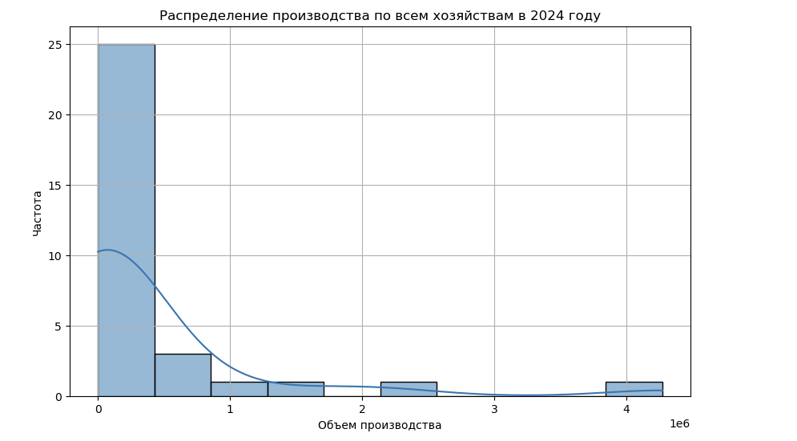
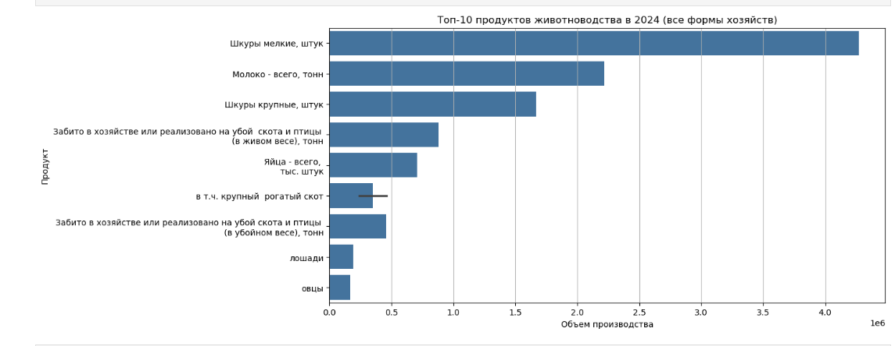

# 📊 Livestock Development in Kazakhstan — 2024 EDA

This project explores the dataset **"Main indicators of livestock development in the Republic of Kazakhstan"** for the year 2024. It includes initial data cleaning, preprocessing, exploratory analysis, and basic visualizations.

## 📁 Dataset Source
[stat.gov.kz - 2024 Livestock Development Data](https://stat.gov.kz/ru/industries/business-statistics/stat-forrest-village-hunt-fish/spreadsheets/?year=&name=18612&period=&type=)

## 🛠 Technologies
- Python 3
- Pandas
- Seaborn / Matplotlib
- Jupyter Notebook (Anaconda)

## ✅ Steps Completed

1. **Data Loading & Inspection**
   - Opened Excel with multiple header rows
   - Identified relevant sheet (`1.`)

2. **Data Cleaning**
   - Assigned proper column names
   - Converted all relevant fields to numeric
   - Handled missing values (retained for analysis)

3. **Basic EDA**
   - Histograms of production volume
   - Bar charts for top 10 livestock products

## 📸 Screenshots

## 📂 Folder Structure

## 💡 Notes
This is a preliminary analysis to prepare the data for further statistical or machine learning modeling.

